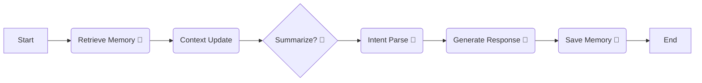

# TongAgent 性能诊断与优化指南

你感觉到"慢"，是因为你的 TongAgent 目前是一个**"单线程的接力赛跑"**。即使不调用 RAG，它也要跑完漫长的障碍赛才能把棒子（回复）交到你手上。

## 1. 为什么这么慢？(病灶分析)

让我们看看 `graph.py` 里的流程。当你说一句 "Hi" 时，后台发生了什么：



### 🐢 这里的每一个龟速节点都在"阻塞"：
1.  **Retrieve Memory (读记忆)**: 每次都要去连 Mem0 数据库（可能是网络请求）。假设耗时 1秒。
2.  **Summarize (做摘要)**: 你的阈值设得太低了 (`len(messages) > 6`)。这意味着没聊几句，它就要调用一次 LLM 重新总结历史。这是最慢的！假设耗时 3-5秒。
3.  **Intent Parse (想意图)**: 必须调用一次 LLM。耗时 2-3秒。
4.  **Generate Response (写回复)**: 必须调用一次 LLM。耗时 2-3秒。
5.  **Save Memory (存记忆)**: 这是一个**完全没必要让用户等**的操作，但你把它放在了主流程里。用户必须等记忆存完，才能看到"结束"信号。假设耗时 1-2秒。

**总耗时** = 1s + 5s(可能) + 3s + 3s + 2s = **10~14秒**！
对于一个简单的 "Hi"，这简直是由于"过度操心"导致的龟速。

---

## 2. Deer Flow 是怎么做的？(他山之石)

Deer Flow 之所以快，是因为它极其擅长**"偷懒"**和**"甩锅"**（异步处理）。

### A. 记忆保存是"甩锅"的 (Fire-and-Forget)
在 `reference/deer-flow/backend/src/agents/middlewares/memory_middleware.py` 中：
它并没有在对话结束时立刻调用 LLM 去总结和存储，而是**把消息扔进一个队列 (Queue)** 就跑了。
*   **用户体验**：说完话立刻收到回复。
*   **后台**：有一个 Worker 慢慢地从队列里拿消息，慢慢地存进数据库。

### B. 摘要是"克制"的
它通常使用 Token 计数来触发摘要，而不是简单的消息条数。只有当 Context Window 快爆了（比如达到 8000 tokens），它才会触发摘要。

---

## 3. 你的优化方案 (Action Plan)

不需要重写成 Middleware，我们只需要调整 `graph.py` 的策略。

### 🚀 优化 1：并行执行 (Parallelism)
`Retrieve Memory` 和 `Context Update` 互不依赖，为什么不让它们一起跑？

**修改 `get_graph`：**
```python
# 原来：Start -> Retrieve -> Context -> Summarize
# workflow.add_edge(START, "retrieve_memory")
# workflow.add_edge("retrieve_memory", "context_update")

# 现在：Start 同时指向两个节点
workflow.add_edge(START, "retrieve_memory")
workflow.add_edge(START, "context_update")

# 然后让它们汇聚到 Summarize (LangGraph 会自动等待两者都完成)
workflow.add_edge("retrieve_memory", "summarize_conversation")
workflow.add_edge("context_update", "summarize_conversation")
```
*收益：节省 1 个网络请求的时间。*

### 🚀 优化 2：调整摘要阈值 (Critical)
把 `summarize_conversation_node` 里的阈值调高！
```python
# tong_agent/graph.py

# 原来：if len(messages) > 6:
# 改为：
if len(messages) > 20: # 或者计算 token 数
```
*收益：减少 80% 的 LLM 调用，速度瞬间起飞。*

### 🚀 优化 3：记忆保存"异步化" (Async Save)
这是大招。在 `graph.py` 里，不要让 `save_memory_node` 阻塞主流程。

**方案 A (简单版)**：
把 `save_memory_node` 移出主图，或者在 Web API 层处理。
但如果你想保留在 Graph 里，可以使用 Python 的 `asyncio.create_task` (如果你的 Graph 是 async 运行的) 或者线程。

**方案 B (实战版 - 推荐)**：
在 `save_memory_node` 里，不要等待 Mem0 返回结果。

```python
import threading

def save_memory_task(user_msg, ai_msg):
    try:
        client = get_mem0_client()
        client.add(...)
    except:
        pass

def save_memory_node(state: AgentState):
    # ... 提取 user_msg, ai_msg ...
    
    # 启动一个后台线程去存，不阻塞主线程
    t = threading.Thread(target=save_memory_task, args=(user_msg, ai_msg))
    t.start()
    
    return {} # 立即返回，不等待
```
*收益：用户回复完全不需要等待记忆存储，响应速度提升 1-2秒。*

---

## 总结

你的 Agent 慢，不是因为本地模型慢，而是因为**主流程上挂了太多不必要的同步任务**。

**立刻能做的改动：**
1.  把 `summarize_conversation_node` 的 `if len(messages) > 6` 改成 `> 20`。
2.  把 `save_memory_node` 改成多线程执行（或者直接注释掉先体验一下速度）。

试一下这两个改动，你会发现速度会有质的飞跃！
