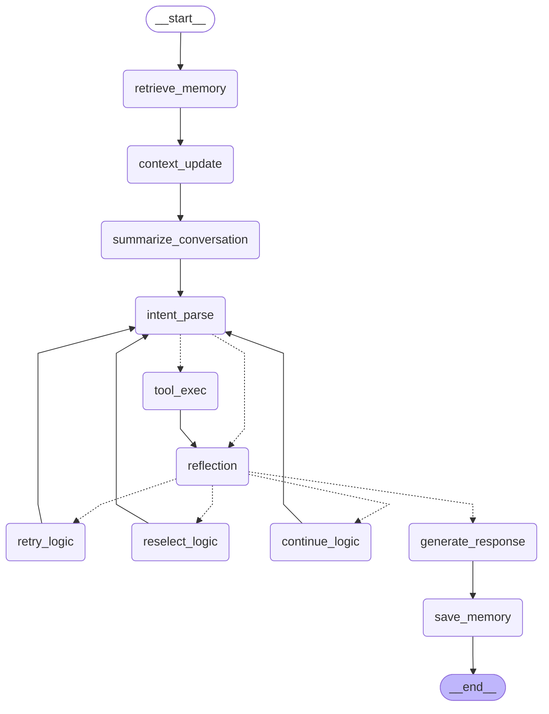

```mermaid
%%{init: {'flowchart': {'curve': 'linear'}}}%%
graph TD;
	__start__([<p>__start__</p>]):::first
	retrieve_memory(retrieve_memory)
	context_update(context_update)
	summarize_conversation(summarize_conversation)
	intent_parse(intent_parse)
	tool_exec(tool_exec)
	reflection(reflection)
	retry_logic(retry_logic)
	reselect_logic(reselect_logic)
	continue_logic(continue_logic)
	generate_response(generate_response)
	save_memory(save_memory)
	__end__([<p>__end__</p>]):::last
	__start__ --> retrieve_memory;
	context_update --> summarize_conversation;
	continue_logic --> intent_parse;
	generate_response --> save_memory;
	intent_parse -.-> reflection;
	intent_parse -.-> tool_exec;
	reflection -.-> continue_logic;
	reflection -.-> generate_response;
	reflection -.-> reselect_logic;
	reflection -.-> retry_logic;
	reselect_logic --> intent_parse;
	retrieve_memory --> context_update;
	retry_logic --> intent_parse;
	summarize_conversation --> intent_parse;
	tool_exec --> reflection;
	save_memory --> __end__;
	classDef default fill:#f2f0ff,line-height:1.2
	classDef first fill-opacity:0
	classDef last fill:#bfb6fc

```